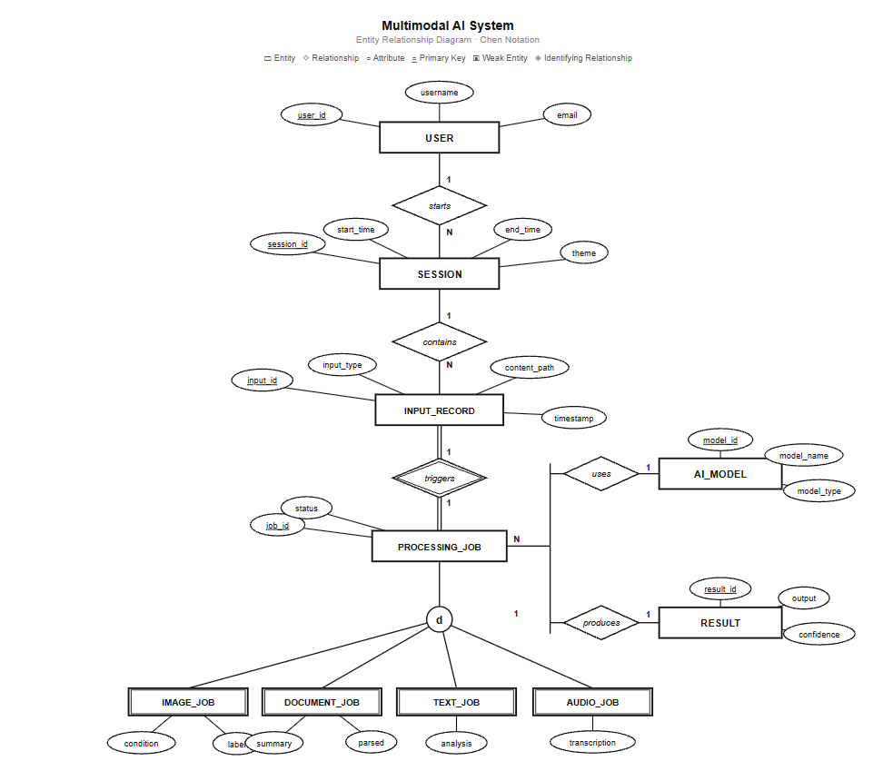

# Orbit — Multimodal AI Assistant

> One AI brain. Four AI tools. The agent decides how to handle your input automatically.

Built during an AI & Automation internship at **Dataserv** (Certified IBM Gold Business Partner) as a Week 4 capstone project.

---

## 🗂️ Entity Relationship Diagram



## 🧠 What is Orbit?

Orbit is a multimodal AI assistant powered by a **LangGraph ReAct agent** that acts as the brain of the system. Instead of separate apps for each task, one agent reads your input and automatically routes it to the right AI-powered tool — no manual selection needed.

---

## 🛠️ The 4 AI Tools

| Tool | Input | What it does |
|------|-------|-------------|
| 📝 **Text** | Any sentence | Classifies the topic (Sports / Politics / Technology / Health / Entertainment) and extracts key entities (Person, Organization, Location, Date, Event) |
| 📄 **PDF Document** | PDF file | Reads and summarizes the document. For invoices, extracts vendor, invoice number, date, line items, and total |
| 🫁 **Chest X-Ray** | X-ray image | Classifies as COVID-19 / Pneumonia / Tuberculosis / Normal using a trained deep learning model |
| 🎙️ **Audio** | Audio file / mic | Transcribes speech to text using Groq Whisper |

---

## 🏗️ Architecture

```
User Input
    │
    ▼
LangGraph ReAct Agent (Groq LLM)
    │
    ├──► text_tool        → LLM classification + NER
    ├──► document_tool    → LLM summarization (pypdf + Groq)
    ├──► image_tool       → MobileNetV2 chest X-ray classifier
    └──► audio_tool       → Groq Whisper STT
```

---


## 🫁 Chest X-Ray Classifier

- **Model:** MobileNetV2 (transfer learning, fine-tuned)
- **Classes:** COVID-19 · Pneumonia · Tuberculosis · Normal
- **Dataset:** Public Kaggle chest X-ray dataset (jtiptj)
- **Test accuracy:** ~90% on 754 held-out test images
- **Per-class accuracy:**
  - COVID-19: 91.0%
  - Pneumonia: 96.4%
  - Tuberculosis: 93.4%
  - Normal: 70.1%
- **Training:** 2-phase (frozen base → fine-tuned top layers), grayscale input, sqrt class weighting, early stopping


---

## 🖥️ Tech Stack

| Layer | Technology |
|-------|-----------|
| Agent | LangGraph · LangChain · Groq LLM (openai/gpt-oss-20b) |
| Speech | Groq Whisper (whisper-large-v3) |
| Vision | TensorFlow · Keras · MobileNetV2 |
| PDF | pypdf |
| UI Framework | Gradio |
| Custom UI | HTML · CSS · JavaScript |
| Language | Python |

---

## ✨ UI Features

- Dark / Light mode toggle with animated theme switcher
- Custom platinum cursor
- Floating metallic orbs background
- Dock-style tab magnification
- Custom "Generating..." loader animation
- Glassmorphism design

---

## 🚀 How to Run

**1. Clone the repo**
```bash
git clone https://github.com/mohassaad/multimodal-ai-assistant.git
cd multimodal-ai-assistant
```

**2. Create a virtual environment**
```bash
python -m venv venv
venv\Scripts\activate        # Windows
source venv/bin/activate     # Mac/Linux
```

**3. Install dependencies**
```bash
pip install -r requirements.txt
```

**4. Add your API key**
Create a `.env` file in the project folder:
```
GROQ_API_KEY=your_groq_api_key_here
```
Get a free key at [console.groq.com](https://console.groq.com)

**5. Add the model file**
The chest X-ray model (`cat_dog_model.keras`) is not included in this repo due to file size. Train it yourself using `train_xray.py` in the Week 3 training project, or contact me for the model file.

**6. Run the app**
```bash
python multimodal_ui.py
```
Open `http://127.0.0.1:7860` in your browser.

---

## 📁 Project Structure

```
multimodal-ai-assistant/
├── multimodal_ui.py        # Main app (agent + tools + UI)
├── requirements.txt        # Dependencies
├── .env                    # API key (not uploaded)
├── cat_dog_model.keras     # Trained X-ray model (not uploaded)
└── README.md
```

---

## ⚠️ Important Notes

- The `.env` file and `.keras` model are excluded from this repo (see `.gitignore`)

---

## 👤 Author

**Mohamed Assaad**
AI & Software Development Intern — Dataserv (IBM Gold Business Partner)

Special thanks to mentor **Omnia Abdelrahman** and teammate **Mohamed Torky**

[](https://www.linkedin.com/in/mohamed-assaad-32b960397/)
[](https://github.com/mohassaad)

---
